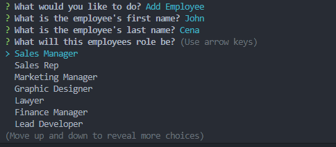

# StaffSync

https://drive.google.com/file/d/1q3ClHQgA8RZ5JVgs_ZlrOG9Vg6e5RIKN/view

## Description
The inspiration behind this was to help create something to keep track of employees, update employee roles, add roles, add departments to test my knowledge with SQL. While working on this project there was a lot of things I learned along the way. Some being the following: 
* Dropping your seeds is very important. I forgot to drop my seeds at first and kept messing with the server.js file trying to see why it wouldnt display it and what not but after trial and error using the prompts mysql provides it helped narrow down the problem, which was that I never dropped the seeds which is why my table wouldnt load. 
* How to add and save the responses into the inquirer prompts. At first I was intimidated by how it would even work but after trying it for myself I learned how its same as normal single prompt requests.

## Table of Contents
-[Descriptions](#Descriptions)
-[Installation](#Installation)
-[Usage](#Usage)
-[Credits](#Credits)
-[Tests](#Tests)
-[License](#License)
-[Questions](##Questions)

## Installation
In order to install this project you will have to clone the repository: 
    1. Create a place where you will want to store all this information 
    2. Once there open GitBash
    3. Clone this repository into the file you will have this stored in
            enter following: git@github.com:juanthtgotaway/StaffSync.git
    4. Press enter to create your local clone

## Usage
This can be used to edit your employee database! 

## Credits
N/A

Other Resources:
N/A

## Tests
N/A
## License
MIT

## Questions
If you have any questions or concerns feel free to reach out via the following:
GitHub:[juanthtgotaway](https://github.com/juanthtgotaway)